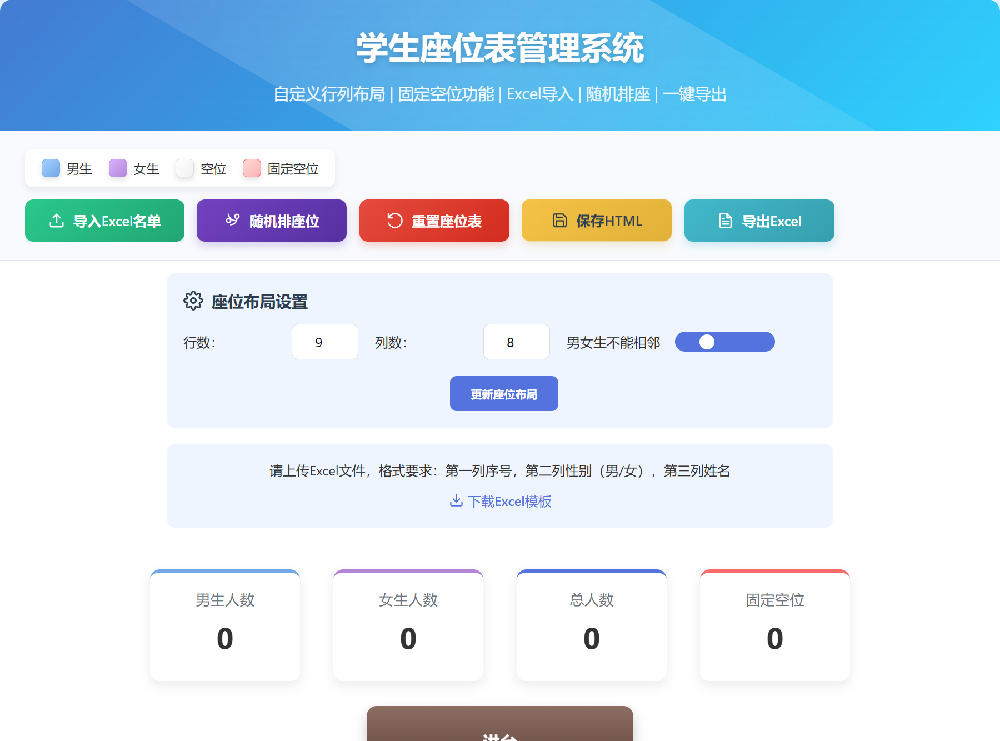

# 座位调整系统

## 简介

本座位调整系统可用于中小学班主任随机调整学生座位，可实现导入学生名单，男女是否同桌，空座位自定义等各种功能。

## 使用说明

1. 设置布局：在座位布局设置中定义教室的行数和列数，点击"更新座位布局"按钮应用设置
2. 导入名单：点击"导入Excel名单"按钮上传Excel文件（格式：序号、性别、姓名）
3. 固定空位：导入学生名单后，系统会要求您选择需要保留为空位的位置，这些位置将始终保持为空
4. 随机排座：点击"随机排座位"按钮将学生随机分配到座位上（固定空位保持不变）
5. 手动调整：拖拽学生卡片可以交换位置（不能拖动到固定空位）
6. 导出功能：导出HTML文件用于存档，导出Excel文件用于打印
7. 重置座位：点击"重置座位表"按钮清除所有学生数据

座位表数据会自动保存在浏览器中，下次打开时恢复

在线使用网站：https://liyutian-web.github.io/Seat_adjustment_system/Seat_adjustment.html

## 页面展示

## 作者声明

本项目开发者：湖北省汉川第二中学田传作
